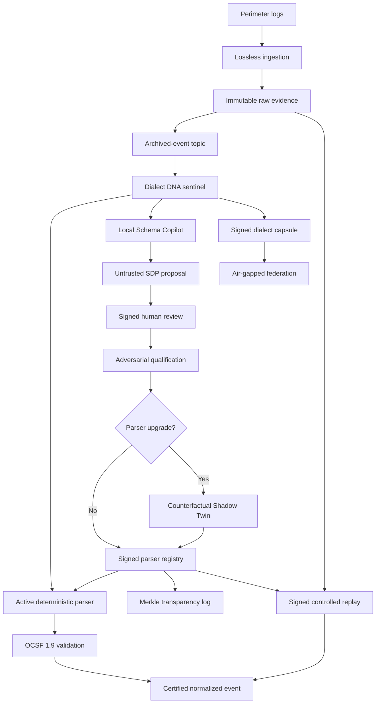

# Drishti

Drishti is a lossless, vendor-neutral Universal Log Pre-processing Framework (ULPF).
The first two patches established archive-before-publish ingestion and a pinned, air-gapped
OCSF 1.9.0 contract plane. Patch 3 adds the governed parser plane: local format discovery,
human-approved Source Definition Packs, adversarial qualification, signed activation, and
controlled replay over immutable evidence. Patch 4 adds an adaptive **Trust Fabric** that detects
format drift, proves upgrade safety against live evidence, makes releases independently auditable,
and shares dialect intelligence across air-gapped sites without exporting raw logs.

## What works now

- Binary-safe event ingestion over HTTP using base64 payloads.
- SHA-256 integrity identity over the exact original bytes.
- Idempotent ingestion with conflict detection.
- Archive-before-publish ordering enforced by the application service.
- In-memory adapters for a fast local vertical slice.
- Health endpoints, typed contracts, tests, linting, CI, and a non-root container.
- Official OCSF `1.9.0` source pinned at an immutable upstream commit.
- Reproducible compressed OCSF bundle containing the private Drishti evidence extension.
- Recursive validation of classes, objects, primitive types, enums, constraints, and IDs.
- Byte-span lineage and tamper-evident semantic conservation certificates.
- Deterministic RFC5424 and CEF parsers with no user-supplied or runtime-compiled regex.
- Declarative Source Definition Packs (SDPs) containing mappings, fixtures, and budgets—not code.
- Air-gapped Schema Copilot that fingerprints and proposes formats but cannot activate them.
- Separation-of-duties workflow with signed human decisions and fail-closed qualification.
- Ed25519-signed parser registry releases and a hash-chained governance audit trail.
- Signed, event-bounded controlled replay pinned to an exact registry revision and pack digest.
- Durable adapters for S3-compatible raw evidence and Kafka-compatible archived-event delivery.
- A local cluster profile using Redpanda and MinIO; core ports remain vendor-neutral.
- Dialect DNA with online Jensen-Shannon drift detection and automatic quarantine decisions.
- Counterfactual Shadow Twin evaluation that is mandatory for parser upgrades.
- Merkle transparency proofs and signed offline-verifiable registry checkpoints.
- Signed k-anonymous Sovereign Dialect Capsules for raw-free cross-site intelligence.

The default process uses in-memory adapters for fast tests. `docker compose up --build` selects
the durable profile: raw bytes are persisted to an object-lock-enabled MinIO bucket before an
idempotent producer publishes the evidence pointer to Redpanda. Production deployments should
replace demo credentials and apply bucket retention, TLS, replication, and external key custody.

OCSF is the normalized event contract—not the parser. Drishti parsers remain deterministic and
must produce events accepted by the pinned contract before a certificate can be issued.

## Quick start

Requires Python 3.11+.

```bash
python -m venv .venv
source .venv/bin/activate
python -m pip install -e ".[dev]"
make check
make run
```

Run the complete governed-parser demonstration:

```bash
python scripts/demo_governed_parser.py
python scripts/demo_trust_fabric.py
```

The command detects an RFC5424 dialect locally, creates an untrusted proposal, records a signed
human approval, runs OCSF/lineage/adversarial/latency gates, publishes a signed registry release,
then performs a separately signed controlled replay. Its final JSON includes the registry and
audit verification results, OCSF event, raw digest, and conservation-certificate digest.
The Trust Fabric demo then simulates a firmware format change, evaluates a parser upgrade against
the active parser, verifies a Merkle inclusion proof, and correlates signed capsules from two
air-gapped sites while proving that raw IP values were not exported.

`make check` also verifies the vendored OCSF source tree and the compiled bundle digest.
No live OCSF service or internet access is used at runtime.

Ingest an event:

```bash
curl -X POST http://localhost:8080/v1/events \
  -H 'content-type: application/json' \
  -d '{
    "tenant_id": "demo-org",
    "source_id": "edge-fw-01",
    "source_type": "firewall",
    "idempotency_key": "device-sequence-42",
    "payload_base64": "PHByaT4xIFNlcCAyNiAxMjozNDo1NiBlZGdlLWZ3LTAxIGRlbnk="
  }'
```

The API returns `202 Accepted` with an event ID, trace ID, and raw SHA-256 digest. Repeating the
same request returns the same event ID with `duplicate: true`. Reusing the same idempotency key
for different bytes returns `409 Conflict`.

Validate a candidate OCSF Network Activity event:

```bash
curl -X POST http://localhost:8080/v1/ocsf/validate \
  -H 'content-type: application/json' \
  -d '{"event": {
    "activity_id": 1,
    "category_uid": 4,
    "class_uid": 4001,
    "metadata": {"product": {"name": "Drishti"}, "version": "1.9.0"},
    "severity_id": 1,
    "src_endpoint": {"ip": "10.0.0.1", "uid": "10.0.0.1"},
    "time": 1798000000000,
    "type_uid": 400101
  }}'
```

The response includes `valid`, the resolved class, structured issues, and the exact schema-bundle
digest used for the decision.

## Governed architecture



Core code depends only on ports (`RawEvidenceStore`, `EventPublisher`). Infrastructure adapters
will remain replaceable so Drishti can run on a laptop, Kubernetes, or an air-gapped cluster.

## Repository map

```text
src/drishti/
  api/          FastAPI transport and schemas
  domain/       immutable event model and invariants
  pipeline/     use cases and infrastructure ports
  adapters/     replaceable in-memory implementations
  copilot/      air-gapped grammar discovery and untrusted SDP proposals
  governance/   signatures, approvals, qualification, audit, parser registry
  ocsf/         pinned contract loader and recursive validator
  parsers/      deterministic RFC5424/CEF grammars and declarative mapping engine
  provenance/   byte-span lineage and conservation certificates
  replay/       signed, bounded, revision-pinned controlled replay
  trust/        dialect drift, shadow promotion, Merkle proofs, raw-free federation
  normalization/certified normalized event envelope
schemas/        separate Drishti OCSF extension
third_party/    unmodified, pinned OCSF source and license
scripts/        reproducible bundle build and integrity verification
tests/          unit and API contract tests
```

## Non-negotiable invariants

1. Original bytes are never mutated.
2. Raw evidence is durably archived before downstream publication.
3. A stable idempotency key cannot point to two different payloads.
4. Every downstream event carries the raw event ID and SHA-256 digest.
5. No normalized event is certified unless it passes the pinned OCSF contract.
6. Every parser claim references exact, non-overlapping raw byte spans.
7. Schema and parser identities are content-addressed, never inferred from `latest`.
8. AI output is always untrusted and has no route around human approval and qualification.
9. Source packs contain declarative data only; executable code and user regex are forbidden.
10. Replay is bounded, independently approved, revision-pinned, idempotent, and non-destructive.
11. A parser upgrade cannot activate without counterfactual evidence from the active dialect.
12. Drift quarantine preserves evidence and cannot silently discard an event.
13. Every transparency proof is independently verifiable from a signed checkpoint.
14. Federated intelligence contains k-anonymous structural fingerprints, never raw log payloads.

## Rebuilding the OCSF bundle

The committed bundle is the runtime artifact. Rebuild it only after an intentional schema or
extension change:

```bash
make build-ocsf
make verify-ocsf
make check
```

See [ADR-0001](docs/decisions/0001-ocsf-contract-plane.md),
[ADR-0002](docs/decisions/0002-governed-parser-plane.md),
[ADR-0003](docs/decisions/0003-adaptive-trust-fabric.md), and the
[third-party notices](THIRD_PARTY_NOTICES.md) for the versioning and licensing decision.
