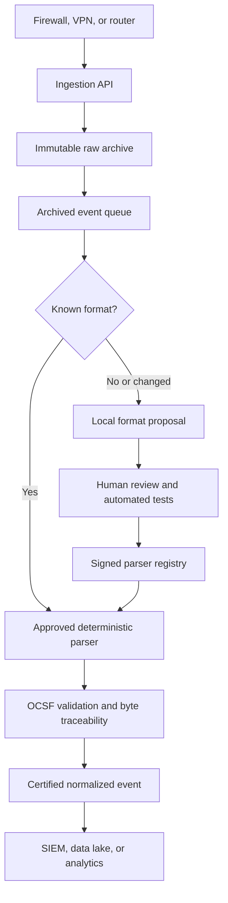
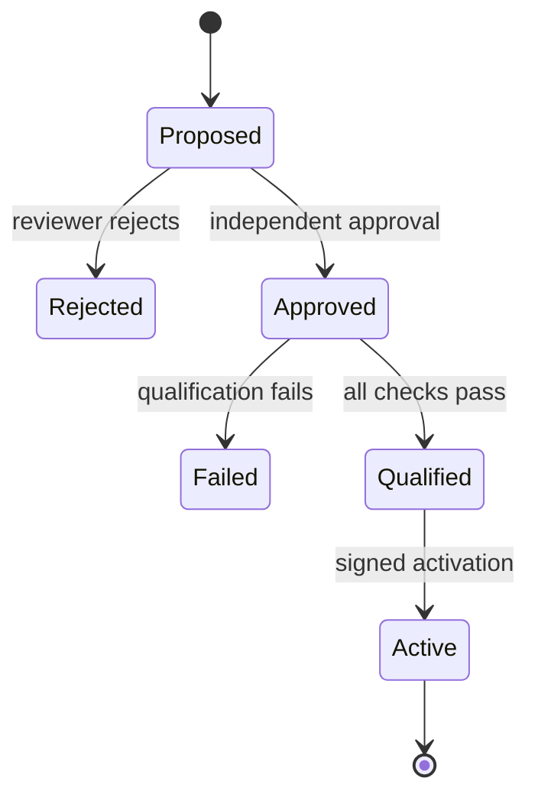

# Drishti

Drishti is a lossless log preprocessing framework for perimeter security devices. It receives
logs from firewalls, VPN gateways, routers, and similar systems; preserves the exact original
bytes; converts supported formats into OCSF events; and records enough evidence to reproduce and
verify every normalization decision.

The project is designed for environments where a parsing mistake is a security and forensic
problem, not merely a malformed row. New parsers therefore cannot be activated directly by an AI
model, a developer, or an administrator. They must pass deterministic tests, independent review,
schema validation, byte-level traceability checks, and signed activation.

## Why Drishti exists

Security products describe the same activity in incompatible formats. Even two devices from the
same vendor may produce different fields after a firmware or configuration change. Conventional
pipelines usually solve this with source-specific scripts. Those scripts are difficult to audit,
can silently discard fields, and often cannot reproduce how an old alert was normalized.

Drishti treats the raw log as evidence and the normalized event as a derived view:

- The original event is stored before any downstream processing occurs.
- Every extracted value points back to its exact byte range in the original event.
- Unmapped bytes remain visible instead of being silently discarded.
- Every normalized event is validated against a pinned, local OCSF schema.
- Every parser release records its definition, tests, approval, qualification report, and signer.
- Old events can be reprocessed without overwriting earlier normalized results.

## End-to-end flow



### What happens to one event

1. **Receive:** the API accepts the event with its source identity and idempotency key.
2. **Identify:** Drishti computes SHA-256 over the exact received bytes.
3. **Archive:** the raw event is written to the evidence store before a queue message is published.
4. **Select parser:** the registry resolves an approved parser for the source and version.
5. **Parse:** a bounded RFC5424 or CEF parser extracts fields without executing generated code.
6. **Normalize:** declarative mapping rules create an OCSF Network Activity event.
7. **Verify:** Drishti validates OCSF structure and checks that parser claims refer to valid,
   non-overlapping byte ranges.
8. **Certify:** the result records the raw digest, parser digest, schema digest, registry revision,
   and normalization revision.
9. **Export:** downstream systems receive the certified normalized event and can retrieve the
   original evidence using its event ID.

If parsing fails, the raw event remains archived. Drishti does not turn parser failure into data
loss.

## Main capabilities

### Lossless ingestion

`RawEvent` stores binary-safe payloads, source metadata, timestamps, trace IDs, and SHA-256
integrity information. Repeating an idempotent request returns the existing event; reusing the
same key for different bytes is rejected as a conflict.

The durable deployment uses MinIO for S3-compatible evidence storage and Redpanda for
Kafka-compatible delivery. The application enforces **archive before publish**, so downstream
processing never receives a pointer to evidence that was not stored successfully.

### OCSF normalization

Drishti uses OCSF `1.9.0` as its normalized event schema. The official source is vendored at a
pinned upstream commit and compiled with a separate Drishti evidence-preservation extension.
Runtime validation uses the packaged bundle and requires no internet connection.

OCSF defines the output contract; it is not used as a parser. Parsing remains deterministic and
source-specific, while OCSF gives every successful result a consistent structure for SIEM,
analytics, and machine-learning consumers.

### Declarative parser definitions

A Source Definition Pack describes:

- the allowed grammar, such as RFC5424 or CEF;
- source identification rules;
- source-to-OCSF field mappings;
- test fixtures and expected values;
- payload and latency limits; and
- the pack identity and semantic version.

Packs are data, not executable plugins. They cannot contain Python, shell commands, WASM,
network calls, imports, templates, or user-supplied regular expressions. New grammar
implementations still require normal source-code review.

### Governed parser onboarding

The local Schema Copilot can inspect samples and draft a Source Definition Pack. Its output is
always an untrusted proposal. The activation path is deliberately separate:



Qualification checks golden fixtures, malformed and truncated inputs, NUL injection, payload
limits, latency budgets, OCSF validity, and byte conservation. A proposer cannot approve their
own pack. Successful releases are signed with Ed25519 and kept in an immutable registry history.

### Controlled replay

Controlled replay safely processes selected archived events with a specific approved parser
version. A signed replay request fixes:

- the exact event IDs;
- source and parser-pack digest;
- parser-registry revision;
- normalization revision;
- requester, independent approver, and reason; and
- maximum event count.

Replay writes a new revision of the normalized output. It never modifies raw evidence and never
replaces the result produced by an earlier parser version. Deterministic output identifiers make
retries safe.

## Safety features for changing log formats

These features strengthen the core pipeline; they do not replace it.

### 1. Privacy-safe format change detection

Drishti learns the structure normally produced by each source. It replaces values with broad
character classes and computes a keyed fingerprint, so IP addresses, usernames, hostnames, and
messages are not retained in the detector. A bounded statistical comparison identifies large
structural changes, such as a firmware update switching a device from RFC5424 to CEF.

Stable events continue to the active parser. Suspicious changes can be mirrored for review or
quarantined while their original bytes remain safe in the evidence archive.

### 2. Side-by-side parser comparison

Before an existing parser is upgraded, Drishti runs the active and proposed versions against the
same immutable raw events. It blocks activation when the proposed parser:

- fails on events accepted by the active version;
- changes critical fields such as time, severity, source IP, or destination IP;
- reduces byte coverage; or
- has not been tested on the configured minimum number of events.

The comparison report is content-addressed and attached to the signed parser release.

### 3. Verifiable parser release history

Parser releases are added to an append-only Merkle history. An auditor can verify a release's
inclusion using a compact proof and signed checkpoint, even on an offline machine. This makes
silent removal or substitution of a release detectable.

### 4. Privacy-safe format sharing

Separate or air-gapped installations can exchange signed summaries of observed log structures
without exchanging raw logs. Rare patterns are suppressed below a configurable k-anonymity
threshold. Shared summaries can indicate that another site has already observed a format, but
they cannot activate a parser or bypass local approval.

## Quick start

Drishti requires Python 3.11 or newer.

```bash
python -m venv .venv
source .venv/bin/activate
python -m pip install -e ".[dev]"
make check
make run
```

The API starts on `http://localhost:8080`. Interactive API documentation is available at
`http://localhost:8080/docs`.

### Run the demonstrations

```bash
python scripts/demo_governed_parser.py
python scripts/demo_parser_safety.py
```

The first demonstration covers local format discovery, human approval, qualification, signed
activation, OCSF normalization, byte traceability, and controlled replay. The second demonstrates
format-change detection, side-by-side parser comparison, release-history verification, and
privacy-safe sharing between two sites.

### Start the durable local deployment

```bash
docker compose up --build
```

This starts Drishti with Redpanda and MinIO. The supplied credentials and single-node services are
for local evaluation. Production deployments must provide TLS, secrets management, replication,
retention policies, backups, and external signing-key custody.

### Frontend console

The React control-plane UI lives in `frontend/` and uses mock responses for endpoints that are not
available in the API yet. With the backend running on port 8080, start the UI with:

```bash
cd frontend
npm install
npm run dev
```

Open `http://localhost:5173`. Mock data is enabled by default; the Settings page can switch to
available API routes, while unavailable routes continue to use mock responses.

## API examples

### Ingest an event

```bash
curl -X POST http://localhost:8080/v1/events \
  -H 'content-type: application/json' \
  -d '{
    "tenant_id": "demo-org",
    "source_id": "edge-fw-01",
    "source_type": "firewall",
    "idempotency_key": "device-sequence-42",
    "payload_base64": "PHByaT4xIFNlcCAyNiAxMjozNDo1NiBlZGdlLWZ3LTAxIGRlbnk="
  }'
```

A successful request returns `202 Accepted` with an event ID, trace ID, and raw SHA-256 digest.
Repeating the same request returns the same event ID with `duplicate: true`. Sending different
bytes with the same idempotency key returns `409 Conflict`.

### Validate an OCSF event

```bash
curl -X POST http://localhost:8080/v1/ocsf/validate \
  -H 'content-type: application/json' \
  -d '{"event": {
    "activity_id": 1,
    "category_uid": 4,
    "class_uid": 4001,
    "metadata": {"product": {"name": "Drishti"}, "version": "1.9.0"},
    "severity_id": 1,
    "src_endpoint": {"ip": "10.0.0.1", "uid": "10.0.0.1"},
    "time": 1798000000000,
    "type_uid": 400101
  }}'
```

The response reports whether the event is valid, the resolved OCSF class, structured validation
issues, and the exact schema-bundle digest used for the decision.

## Repository layout

```text
src/drishti/
  adapters/       MinIO, Kafka, and in-memory infrastructure implementations
  api/            FastAPI application and request/response models
  copilot/        local format discovery and untrusted parser proposals
  domain/         immutable raw-event model
  governance/     signing, review, qualification, audit, and parser registry
  normalization/  certified normalized-event envelope
  ocsf/           packaged schema loader and recursive validator
  parsers/        RFC5424/CEF parsing and declarative mapping engine
  pipeline/       ingestion use cases and infrastructure interfaces
  provenance/     byte ranges and conservation certificates
  replay/         signed, bounded controlled replay
  safety/         format detection, parser comparison, and release verification
schemas/          Drishti's separate OCSF extension
scripts/          demonstrations and reproducible OCSF build checks
tests/            unit, integration, contract, and adversarial tests
third_party/      pinned OCSF source and licensing material
```

## Security and correctness rules

The implementation is organized around these invariants:

1. Original event bytes are never mutated.
2. Raw evidence is archived before downstream publication.
3. One idempotency key cannot identify two different payloads.
4. Every derived event identifies its raw event and SHA-256 digest.
5. Normalized events must pass the pinned OCSF contract before certification.
6. Parser field claims must reference valid, non-overlapping raw byte ranges.
7. Parser and schema versions are content-addressed; processing never follows an unpinned
   `latest` reference.
8. AI-generated proposals have no activation authority.
9. Source Definition Packs contain declarative data rather than executable code.
10. Parser approval, qualification, activation, and replay are auditable and signed.
11. Parser upgrades require a successful side-by-side comparison.
12. Format quarantine preserves evidence and never silently drops an event.
13. Parser release proofs can be verified from a signed offline checkpoint.
14. Cross-site format summaries contain no raw log payloads.

## Rebuilding the OCSF bundle

The compiled OCSF bundle is committed as a runtime artifact. Rebuild it only after an intentional
schema or Drishti-extension change:

```bash
make build-ocsf
make verify-ocsf
make check
```

`make check` verifies both the vendored OCSF source tree and the compiled bundle digest. Runtime
operation does not contact an OCSF service or require internet access.

## Current scope

The current parser surface covers deterministic RFC5424 and CEF perimeter-device events and maps
them to OCSF Network Activity. The architecture supports additional source packs, but a new wire
grammar still requires implementation and review. The local Schema Copilot is a constrained
proposal generator, not a general model that can understand every proprietary binary protocol.

This distinction is intentional: Drishti aims to make onboarding faster without claiming that an
unknown format can be safely normalized without evidence, testing, or human judgment.

## Design decisions and licenses

- [OCSF schema decision](docs/decisions/ocsf-schema.md)
- [Parser governance decision](docs/decisions/parser-governance.md)
- [Parser safety decision](docs/decisions/parser-safety.md)
- [Third-party notices](THIRD_PARTY_NOTICES.md)
