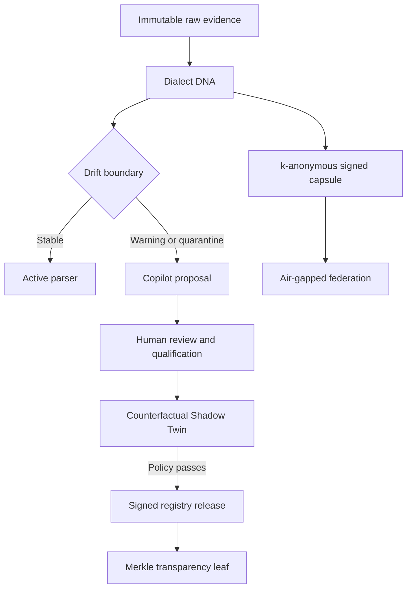

# ADR-0003: Adaptive Parser Trust Fabric

- Status: accepted
- Date: 2026-09-26

## Context

Conventional log pipelines assume that a source format remains stable after onboarding. In
practice, firmware updates, vendor configuration changes, localization, truncation, and malicious
inputs create new dialects without notice. A parser may remain syntactically successful while
silently changing security meaning. Centralized parser intelligence is also unsuitable for
air-gapped or sovereignty-sensitive deployments.

Drishti already signs, qualifies, and versions parser packs. Patch 4 extends this from static
governance into an adaptive trust fabric.

## Decision

### 1. Dialect DNA and drift quarantine

Each event is converted into a value-redacted structural shape. Alphabetic, numeric, whitespace,
printable-delimiter, and binary classes are run-length encoded and authenticated with a keyed
HMAC-SHA-256. Raw values, IP addresses, usernames, hostnames, and messages never enter the
fingerprint.

The sentinel learns a trusted baseline and compares it with a bounded online window using
Jensen-Shannon divergence:

\[
JSD(P,Q)=\frac{1}{2}D_{KL}(P\parallel M)+\frac{1}{2}D_{KL}(Q\parallel M),
\qquad M=\frac{P+Q}{2}
\]

A normalized structural-feature distance catches changes that do not create a completely new
fingerprint. The result is `stable`, `warning`, or `quarantine`. Quarantine routes evidence to
the existing lossless archive and Copilot review path; it never drops the event.

### 2. Counterfactual Shadow Twin

Every upgrade is executed with both the active and candidate parser over the same immutable raw
event IDs. Drishti compares flattened OCSF semantics, critical security fields, parser failures,
and conservation scores. Production promotion defaults are fail-closed:

- no candidate parse failures;
- no changes to critical identity, time, severity, or endpoint semantics;
- complete candidate byte conservation; and
- a minimum evidence population before a decision.

The shadow report is content-addressed and bound into the signed registry release. First-time
onboarding remains governed by approval and qualification; upgrades additionally require shadow
evidence.

### 3. Parser Transparency Log

Registry releases can be appended to an RFC6962-inspired Merkle tree using domain-separated leaf
and node hashes. Any offline verifier can validate an inclusion proof against a signed checkpoint
without accessing the registry database. This makes silent deletion, substitution, or equivocation
detectable when checkpoints are exchanged between oversight domains.

### 4. Sovereign Dialect Capsules

Air-gapped sites may exchange signed intelligence capsules rather than logs. A capsule contains
only keyed structural fingerprint bins, quantized feature centroids, counts, and a pseudonymous
site identity. Rare bins are suppressed below a configurable k-anonymity threshold. A federation
aggregator verifies site signatures and computes weighted-Jaccard similarity to identify shared
or novel dialects.

The federation key must be delivered through an approved offline key ceremony. Key compromise
reduces fingerprint unlinkability, so rotation and per-federation scoping are required. Capsules
are an intelligence hint; they never activate a parser.

## Trust flow

## Consequences

- Format drift becomes observable before dashboards and detections silently degrade.
- Parser upgrades carry empirical impact evidence rather than relying on fixture success alone.
- External auditors can prove that a parser release was included in an append-only history.
- Multiple sovereign deployments can share dialect intelligence without centralizing raw logs.
- HMAC federation keys, checkpoint distribution, baseline poisoning, and representative shadow
  corpora become explicit operational responsibilities.
