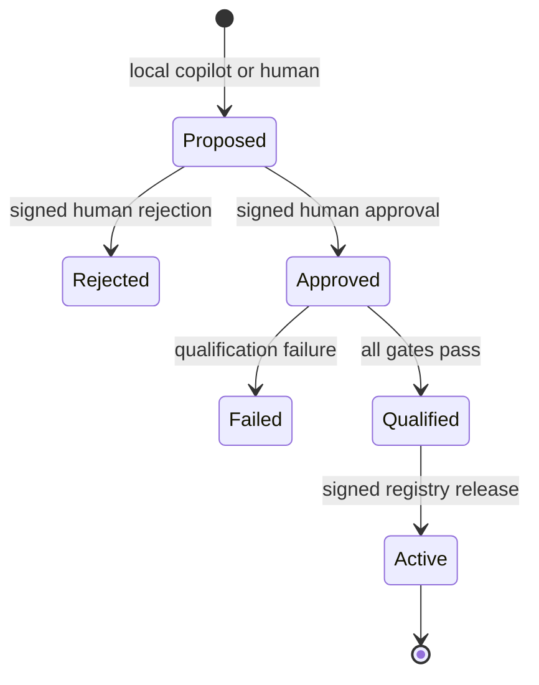

# Decision: Require review and signatures before parser activation

- Status: accepted
- Date: 2026-09-26

## Context

A universal parser that accepts generated code is a remote-code-execution surface. A parser
that activates an AI suggestion automatically can also silently corrupt security evidence.
Drishti therefore separates format discovery from trusted normalization.

## Decision

Parser behavior is represented by a declarative **Source Definition Pack (SDP)**. An SDP can
select only an audited grammar and transformation allowlist; it cannot contain regex supplied
by a user, Python, WASM, shell, templates, imports, or network calls.

Activation is an explicit state machine:

Every release binds these content-addressed artifacts:

1. canonical SDP and embedded fixtures;
2. automated qualification report;
3. independent human decision; and
4. registry activation record.

Ed25519 signs each trust transition. Reviewers cannot approve their own proposal. The audit
log hash-links all decisions. Registry versions increase monotonically per source.

Qualification runs the golden fixtures through parsing, mapping, strict OCSF validation, and
byte-conservation verification. It also rejects NUL injection, truncation, oversized events,
and parser packs that breach their declared p95 latency budget.

## Controlled replay

Replay never mutates raw evidence or follows an unpinned `latest` tag. A signed manifest binds
the exact event IDs, source key, registry revision, pack digest, output revision, reason,
requester, and a distinct approver. Output identifiers are deterministic, making retries
idempotent while retaining every normalization revision.

## Consequences

- Local AI accelerates onboarding but has zero activation authority.
- A compromised copilot cannot introduce executable parser code.
- Operators can reproduce exactly which parser/schema generated any event.
- Emergency changes require an explicit reviewed version and cannot silently rewrite history.
- The initial format surface is intentionally narrow: deterministic RFC5424 and CEF for
  perimeter-device logs. New grammars enter through code review; new vendor mappings use SDPs.
