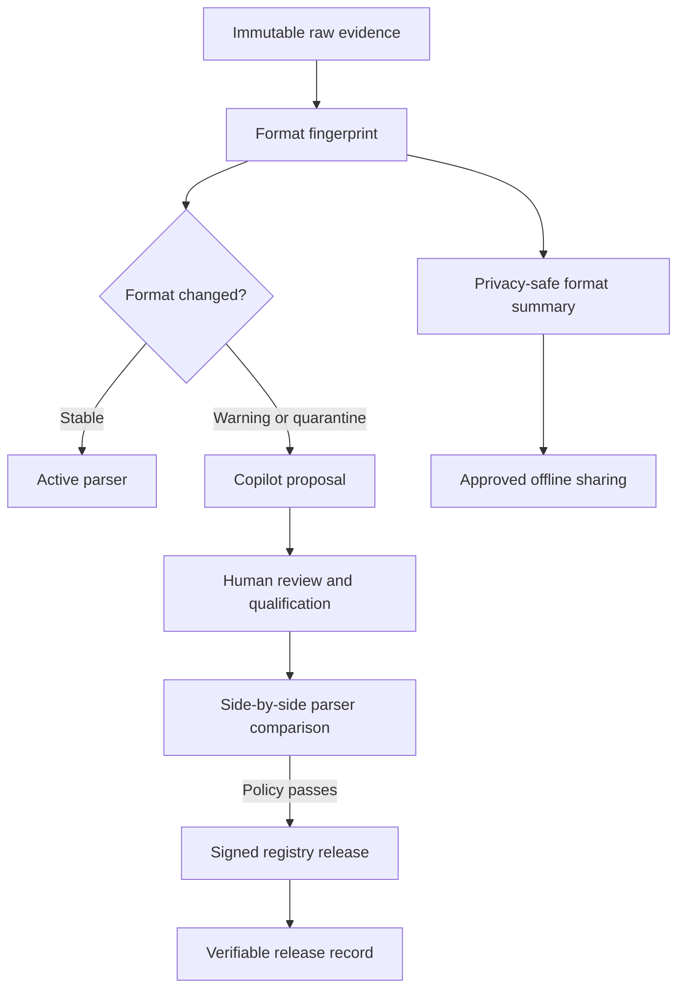

# Decision: Detect format changes and verify parser upgrades

- Status: accepted
- Date: 2026-09-26

## Context

Conventional log pipelines assume that a source format remains stable after onboarding. In
practice, firmware updates, vendor configuration changes, localization, truncation, and malicious
inputs create new formats without notice. A parser may remain syntactically successful while
silently changing security meaning. Centralized parser intelligence is also unsuitable for
air-gapped or sovereignty-sensitive deployments.

Drishti already signs, qualifies, and versions parser packs. The controls in this document add
continuous format monitoring and safer parser upgrades.

## Decision

### 1. Privacy-safe format change detection

Each event is converted into a value-redacted structural shape. Alphabetic, numeric, whitespace,
printable-delimiter, and binary classes are run-length encoded and authenticated with a keyed
HMAC-SHA-256. Raw values, IP addresses, usernames, hostnames, and messages never enter the
fingerprint.

The detector learns a trusted baseline and compares it with a bounded online window using
Jensen-Shannon divergence:

\[
JSD(P,Q)=\frac{1}{2}D_{KL}(P\parallel M)+\frac{1}{2}D_{KL}(Q\parallel M),
\qquad M=\frac{P+Q}{2}
\]

A normalized structural-feature distance catches changes that do not create a completely new
fingerprint. The result is `stable`, `warning`, or `quarantine`. Quarantine routes evidence to
the existing lossless archive and Copilot review path; it never drops the event.

### 2. Side-by-side parser comparison

Every upgrade is executed with both the active and candidate parser over the same immutable raw
event IDs. Drishti compares flattened OCSF semantics, critical security fields, parser failures,
and conservation scores. Production promotion defaults are fail-closed:

- no candidate parse failures;
- no changes to critical identity, time, severity, or endpoint semantics;
- complete candidate byte conservation; and
- a minimum evidence population before a decision.

The comparison report is content-addressed and bound into the signed registry release. First-time
onboarding remains governed by approval and qualification; upgrades additionally require a
successful comparison report.

### 3. Verifiable parser release history

Registry releases can be appended to an RFC6962-inspired Merkle tree using domain-separated leaf
and node hashes. Any offline verifier can validate an inclusion proof against a signed checkpoint
without accessing the registry database. This makes silent deletion, substitution, or equivocation
detectable when checkpoints are exchanged between oversight domains.

### 4. Privacy-safe format sharing between sites

Air-gapped sites may exchange signed format summaries rather than logs. A summary contains
only keyed structural fingerprint bins, quantized feature centroids, counts, and a pseudonymous
site identity. Rare bins are suppressed below a configurable k-anonymity threshold. A matcher
verifies site signatures and computes weighted-Jaccard similarity to identify shared or unknown
formats.

The sharing key must be delivered through an approved offline key ceremony. Key compromise
reduces fingerprint unlinkability, so rotation and per-group scoping are required. Summaries
are an intelligence hint; they never activate a parser.

## Safety flow

## Consequences

- Format drift becomes observable before dashboards and detections silently degrade.
- Parser upgrades carry empirical impact evidence rather than relying on fixture success alone.
- External auditors can prove that a parser release was included in an append-only history.
- Multiple deployments can share format intelligence without centralizing raw logs.
- HMAC sharing keys, checkpoint distribution, baseline poisoning, and representative comparison
  corpora become explicit operational responsibilities.
